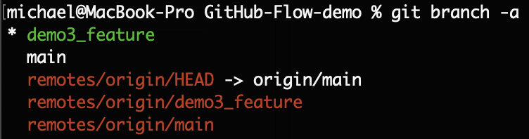
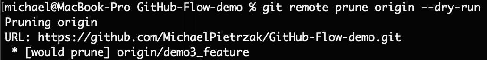
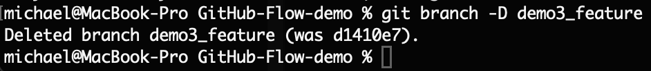

# Git-Cheat-Sheet

Notes with commit tips, branching strategies, command shortcuts and more.


<br />

## Table of contents

- [Good Git commit tips](#keyboard-keys-cheatsheet)
- [Github Flow](#github-flow)
- [Git command shortcuts](#git-command-shortcuts)


<br />

## Good Git commit tips
Mostly based on [Conventional Commits](https://www.conventionalcommits.org/en/v1.0.0/)
<br />

**Conventional Commits** define a standard format in commit messages.They let you easily scan valuable context about your
changes.

Write the commit message as if it’s about to be applied, rather than about what you just did.

Your commit message should be concise and state the context of the change.

Ensure that it is short and use an imperative mood

<br />

### Commit message structure

```
<type>[optional scope]: <description>

[optional body]

[optional footer(s)]
```

<br />

### Commit Types
The ```<type>``` field provides the context for the commit. It communicates the intent of the change that was made.

<br />

```<Types>``` **defined below:**

**feat:** a new feature

**fix:** a bug fix

**style:** changes that do not affect the meaning of the code (white-space, formatting, missing semi-colons, etc)

**refactor:** a code change that neither fixes nor adds a feature

**test:** adding missing tests or correcting existing tests

**docs:** documentation only changes

**chore:** other changes that don't modify src or test files

**build:** changes that affect the build system or external dependencies (example scopes: gulp, broccoli, npm)

**ci:** changes to our CI configuration files and scripts (example scopes: Travis, Circle, BrowserStack, SauceLabs)Deprecate:

**perf:** a code change that improves performance

**revert:** reverts a previous commit

<br />

### Scopes *(Optional)*
The ```<scope>``` field is optional used describing with a noun a section of the codebase.

<br />

The first word in your commit ```<description>``` should be for example:

- add
- create
- refactor
- fix
- release
- document
- highlight
- format
- allow 
- implement
- modify
- update
- remove
- delete etc…

<br />

### Body *(Optional)*
```[optional body]``` is optional with additional details in the commit describing the change that was made or feature that was added.

<br />

### Footer *(Optional)*
```[optional footer(s)]```  is optional which can provide additional metadata for a commit. It alerts readers and tools to significant changes such as breaking changes or can link commits to issues or pull requests.

<br />

### Rules of a great Git commit message
- Separate subject from body with a blank line
- Limit the subject line to 50 characters 
- Stay consistent with the style of commits (ex. first letter of commit uppercase or lowercase)
- Do not end the subject line with a period
- Use the imperative mood when in the subject line
- Wrap the body at 72 characters
- Use the body to explain what/why the change was made. (Optional)
- Remove unnecessary punctuation marks
- Make sure to follow top conventions throughout all project

<br />

### Few examples of good git commits
docs: add short circuit to hook example <br />
docs: fix typo in code inside README.md <br />
fix(deps): update dependency cz-conventional-changelog to v3 <br />
fix(deps): update dependency lodash to v4.17.15 <br />
chore: update mocha, other dev deps <br />
fix(node): remove node 6 and 8 support <br />
chore(deps): update dependency semantic-release to v15.13.18 <br />
fix: update dependencies for security <br />
fix(deps): update dependency lodash to v4.17.14 <br />
docs: highlight pre-requisties and bubble up related sections <br />
fix(cli): allow argv to be overridden in bootstrap <br />
feat(cli): implement --hook option for git hooks integration <br />
test(ED-439): add tests for Modal component <br />
style: format code with new prettier config <br />

*More examples in [Conventional Commits](https://www.conventionalcommits.org/en/v1.0.0/) official documentation.*

<br />

## Github Flow
Github Flow is a branching strategy used by Github. It is the easiest and best suggested for small projects with quick release.

<br />

### Github Flow Process

1. Create Branch
2. Edit Branch
3. Create a Pull Request
4. Merge Pull Request
5. Delete Branch

<br />

Great Github flow explanation with visual illustration can be found [here](https://www.alexhyett.com/git-flow-github-flow/) as well as in [Github Flow official documentation](https://docs.github.com/en/get-started/using-github/github-flow) on Github.

<br />

### Delete branching issue after merge
Github has an option to delete a branch after merging of pull request. After a pull request has been merged, you'll see a button to delete the branch. This action will delete the branch **only in remote.**

<br />
In order to delete the branch locally we have to perform number of commands below:

<br />

Let's say, our branch to delete is ```demo3_feature```

<br />

1. **List branches in local machine**

   The command ```git branch -a``` shows the test branch ```demo3_feature``` is present on local and also present on remote.

     

   <br />

2. **Prune/Cleanup the local references to remote branch**

   The command ```git remote prune origin --dry-run``` lists branches that can be deleted/pruned on your local. An option ```--dry-run``` is needed.

     

   <br />

    Now go ahead and actually prune/cleanup the local references by running the command ```git remote prune origin```. Note that you don't need an option ```--dry-run```.

     

    <br />

    Again, run the command ```git branch -a``` will show the local status of branches and there you can notice that ```remotes/origin/demo3_feature``` has been removed, but not the local branch ```demo3_feature```.

    <br />

3. **Delete local branch**

    In order to delete local branch ```demo3_feature```, we have to perform command ```git branch -d demo3_feature```

     

<br />
    
## Git command shortcuts

